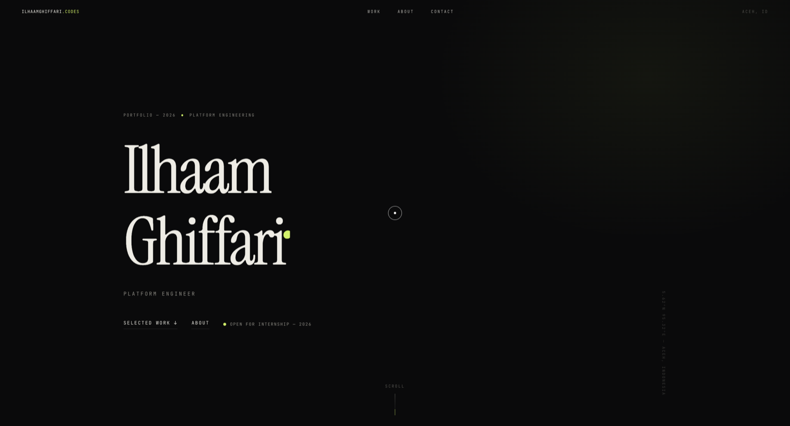

# Ilhaam Ghiffari — Portfolio

[](https://ilhaamghiffari.codes)
[](https://github.com/IlhaamGhiffari/ilhaamghiffari.github.io/actions/workflows/deploy.yml)
[](https://svelte.dev)
[](LICENSE)

Awwwards-style portfolio for [Ilhaam Ghiffari](https://github.com/IlhaamGhiffari) — platform engineer with a side of hydrological modeling (F.J. Mock, debit andalan). Built with **SvelteKit** (static adapter), animated with **GSAP** + **Lenis**, and deployed to **GitHub Pages** via **GitHub Actions**.



## ✨ Highlights

- **Editorial dark design** — Instrument Serif display type, mono accents, film-grain texture
- **Motion-forward** — split-text hero reveal, scroll-triggered animations (GSAP ScrollTrigger), smooth scrolling (Lenis), custom cursor
- **Accessibility-minded** — semantic HTML, `prefers-reduced-motion` fully respected, keyboard-focus states
- **Fully static** — prerendered output, no server required, fast on Pages
- **Real content** — every project, metric, and link is verifiable (no placeholders)

## 🛠 Tech Stack

| Layer | Tech |
|---|---|
| Framework | [SvelteKit](https://svelte.dev) 5 — `@sveltejs/adapter-static` |
| Language | TypeScript |
| Animation | [GSAP](https://gsap.com) (ScrollTrigger) · [Lenis](https://lenis.darkroom.engineering) |
| Fonts | Instrument Serif · Inter · JetBrains Mono (Google Fonts) |
| Hosting | GitHub Pages |
| CI/CD | GitHub Actions (`deploy.yml`) |

## 📁 Project Structure

```
.
├── .github/workflows/deploy.yml   # CI/CD — build & deploy to GitHub Pages
├── src/
│   ├── app.css                    # design tokens, reset, utilities
│   ├── lib/
│   │   ├── components/            # Hero, Work, About, Contact, Nav, Cursor, Marquee
│   │   ├── data.ts                # content: projects, skills, timeline
│   │   └── motion.ts              # Lenis + GSAP/ScrollTrigger wiring
│   └── routes/                    # +layout.svelte, +page.svelte (prerendered)
├── static/
│   ├── CNAME                      # custom domain: ilhaamghiffari.codes
│   └── preview/                   # screenshots used in this README
└── package.json
```

## 🚀 Getting Started

Requires Node.js 22+ and npm.

```bash
npm install       # install dependencies
npm run dev       # dev server → http://localhost:5173
npm run check     # svelte-check (type checking)
npm run build     # prerender static site → build/
npm run preview   # serve the production build locally
```

## 🤖 CI/CD

[`.github/workflows/deploy.yml`](.github/workflows/deploy.yml) builds and publishes the site on every push to `main` (or manual `workflow_dispatch`):

1. `checkout` + `setup-node` (v22, npm cache)
2. `npm ci` → `npm run build` (prerendered static output)
3. `upload-pages-artifact` → `deploy-pages` (Pages source: **GitHub Actions**)

No manual deploy steps — push and it ships.

## 🌐 Custom Domain

`ilhaamghiffari.codes` (apex) is registered via `static/CNAME`. DNS at the registrar:

```
A     @    → 185.199.108.153
A     @    → 185.199.109.153
A     @    → 185.199.110.153
A     @    → 185.199.111.153
CNAME www  → ilhaamghiffari.github.io
```

TLS is auto-provisioned by GitHub (Let's Encrypt); `www` ↔ apex redirect is automatic.

## 📄 License

MIT — see [LICENSE](LICENSE).

---

© 2026 Muhaammad Ilhaam Ghiffari · [ilhaamghiffari.codes](https://ilhaamghiffari.codes)
